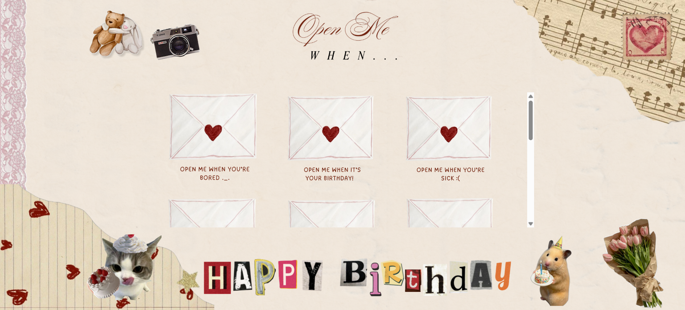
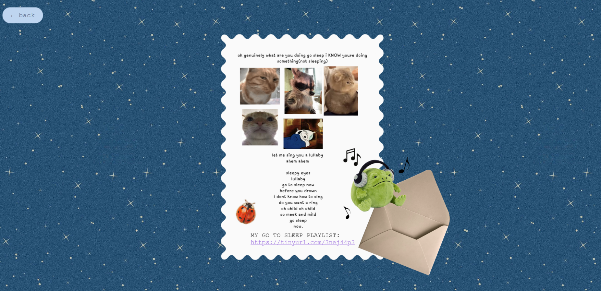
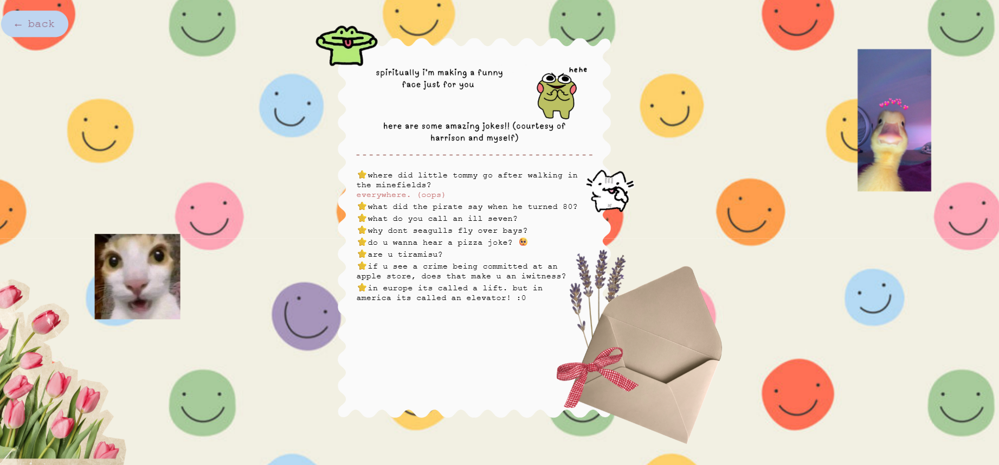

# letters 💛
### an online version of diy open me letters! 
I created this website for my best friend's birthday. I've always wanted to make physical 'open me when' letters, but since I've been learning to code recently I thought to try this out!

I used: HTML, CSS, and JS. I struggled with formatting the images and layering the text, but I feel a lot more comfortable with CSS now. JS is still the most confusing for me :(, theres so many features but I'm starting to see the similarities with Python which I have some experience with.

### there are essentially 2 main screens:

1. home screen. click on the letters to proceed to the letter page!

2. the letter page!

## some features ~
there are a LOT of features I think are really cool! You can hover over many of the elements and drag them wherever you want. Hover over text and it'll scale up!

this is one of my favorite pages --> 
click on each joke to reveal the secret message oOOoOoOOoh(the punchline lol). 

site at https://gabbyqgu.github.io/letters/index.html ! enjoy :) happy birthday bestie! 🎉🎂🥳🤓